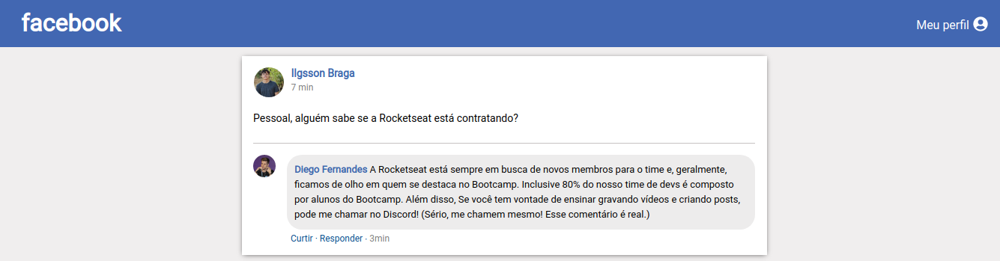
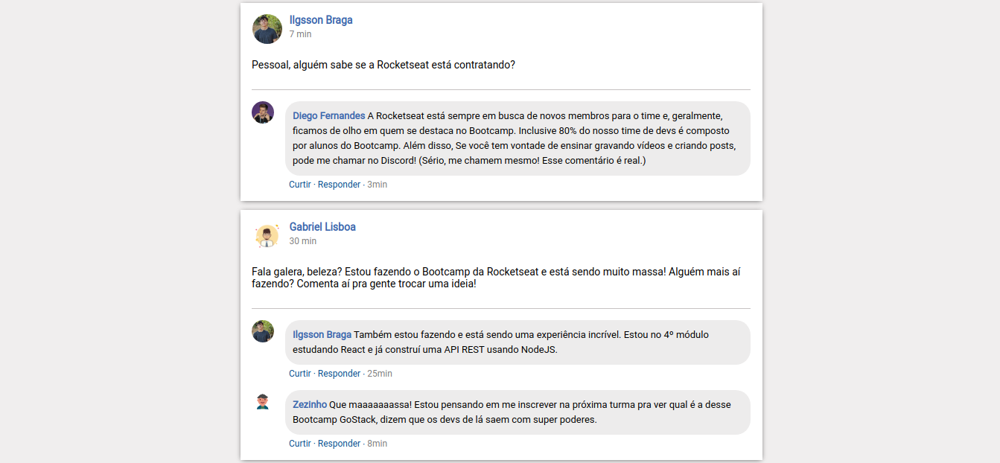

# Bootcamp GoStack - Challenger 04

Interface like facebook using ReactJS

 <br/>

 <br/>

# :computer: Tecgnologies used

<ul>
  <li><a href="https://reactjs.org/">Reactjs</a></li>
  <li><a href="https://webpack.js.org/">Webpack</a></li>
  <li><a href="https://github.com/webpack/webpack-dev-server">Webpack Dev Server</a></li>
  <li><a href="https://babeljs.io/">Babel</a></li>
</ul>

# Getting Started

Fisrt things first, install the the dependencies on directory using the command below:

```bash
yarn

```

Now, run with:

```bash
yarn dev

```

From there everything will be configured.

## :memo: License

This project is under the MIT license. See [License](LICENSE.md) for more details.

---

by [Ilgsson Braga](https://github.com/IlgssonBraga)
