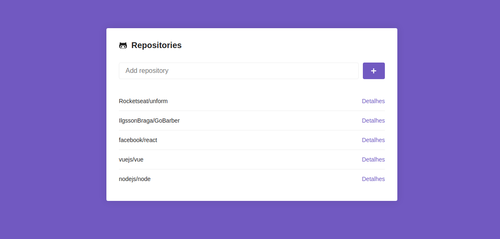
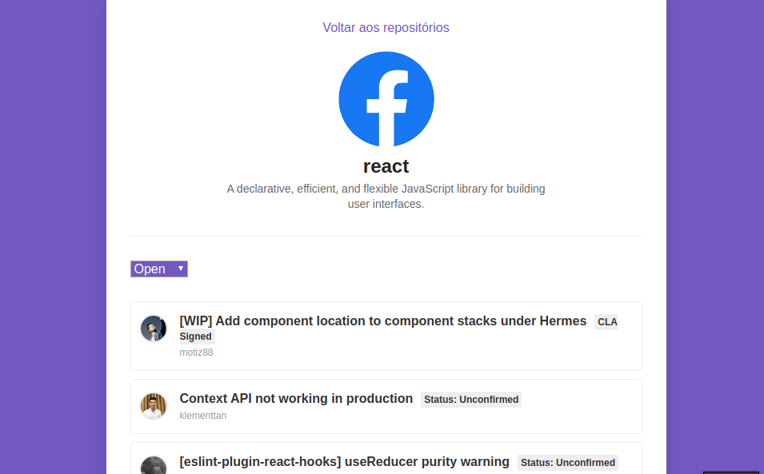
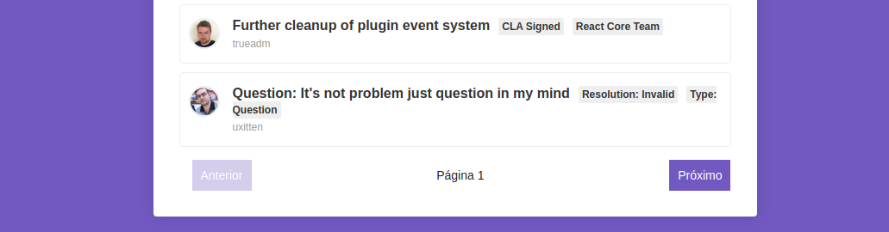

# Bootcamp GoStack - Challenger 05

Improvements in the app created during module 05 of the Rocketseat's Bootcamp GoStack.

 <br/>

 <br/>

 <br/>

# :computer: Tecgnologies used

<ul>
  <li><a href="https://reactjs.org/">Reactjs</a></li>
  <li><a href="https://webpack.js.org/">Webpack</a></li>
  <li><a href="https://github.com/webpack/webpack-dev-server">Webpack Dev Server</a></li>
  <li><a href="https://babeljs.io/">Babel</a></li>
  <li><a href="https://styled-components.com/docs/basics">Styled Components</a></li>
  <li><a href="https://reacttraining.com/react-router/web/guides/quick-start">React Router Dom</a></li>
   <li><a href="https://github.com/axios/axios">Axios</a></li>
    <li><a href="https://www.npmjs.com/package/prop-types">Prop Types</a></li>
</ul>

# Getting Started

Fisrt things first, install the the dependencies on directory using the command below:

```bash
yarn

```

Now, run with:

```bash
yarn start

```

From there everything will be configured.

## :memo: License

This project is under the MIT license. See [License](LICENSE.md) for more details.

---

by [Ilgsson Braga](https://github.com/IlgssonBraga)
