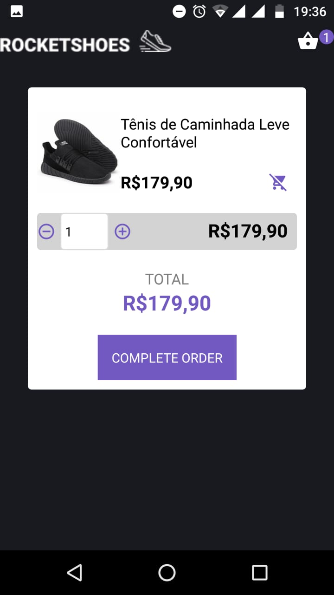
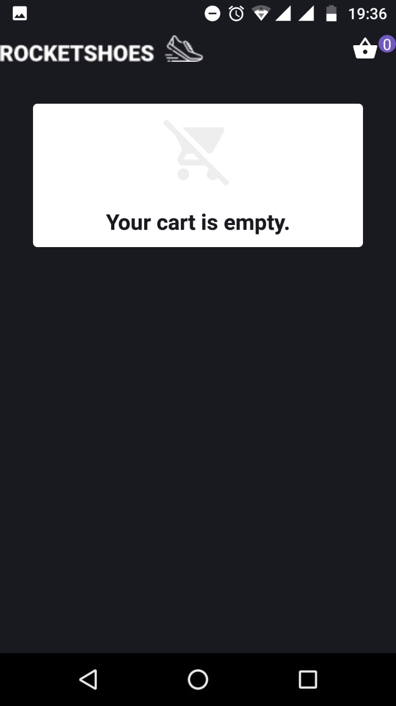

# Bootcamp GoStack - Challenger 08

Converting the [application](https://github.com/IlgssonBraga/bootcamp-gostack-desafio-07) of challenge 7 to the use of React Hooks.

 <br/>

 <br/>

 <br/>

 <br/>

# :computer: Tecgnologies used

<ul>
  <li><a href="https://reactnative.dev/?utm_source=jobhired.io">React Native</a></li>
  <li><a href="https://styled-components.com/docs/basics">Styled Components</a></li>
  <li><a href="https://github.com/axios/axios">Axios</a></li>
  <li><a href="https://reactnavigation.org/docs/getting-started/">React Navigation</a></li>
  <li><a href="https://github.com/infinitered/reactotron/blob/master/docs/quick-start-react-native.md">Reactotron</a></li>
  <li><a href="https://facebook.github.io/flux/">Flux</a></li>
  <li><a href="https://github.com/reduxjs/react-redux">Redux</a></li>
  <li><a href="https://pt-br.reactjs.org/docs/hooks-intro.html">React Hooks</a></li>


</ul>

# Getting Started

Fisrt things first, install the the dependencies on directory using the command below:

```bash
yarn

```

<p>Follow the steps for install the React Native environment: https://docs.rocketseat.dev/ambiente-react-native/introducao</p>

<p>Now, run:</p>

```bash
react-native run-android

```

and

```bash
react-native start

```


## :memo: License

This project is under the MIT license. See [License](LICENSE.md) for more details.

---
